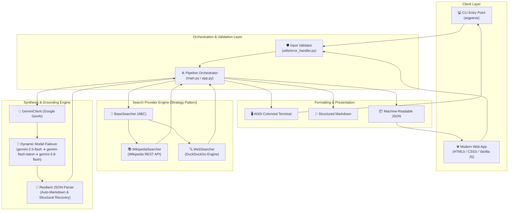

<div align="center">

### Autonomous Multi-Source Research Engine with Grounded Citations & Synthesis

[](https://python.org)
[](https://aistudio.google.com/)
[](https://flask.palletsprojects.com/)
[](https://opensource.org/licenses/MIT)
[](https://github.com/jashantiwari044/AI-Research-Assistant)

<p align="center">
  <b>A full-stack, production-grade research assistant that autonomously queries external knowledge bases (Wikipedia & Web), synthesizes findings using Google Gemini, and delivers structured reports with inline source citations.</b>
</p>

[Quick Start](#-quick-start) • [Architecture](#-architecture--data-flow) • [CLI Manual](#-cli-usage-guide) • [Web Application](#-web-interface) • [Design Patterns](#-software-architecture--design-patterns) • [API Specification](#-api-specification)

</div>

---

## 🌟 Overview

The **AI Research Assistant** solves the core limitation of standard LLMs: **hallucinations and outdated knowledge**. Rather than relying solely on parametric model memory, it employs an **Agentic Retrieval-Augmented Synthesis (RAG)** pipeline:

1. **Accepts** complex research inquiries via CLI or Web UI.
2. **Federates Searches** across multiple external sources simultaneously (Wikipedia Encyclopedia API + DuckDuckGo Web Index).
3. **Grounds Synthesis** strictly in retrieved documents using engineered prompt constraints.
4. **Maps Precise Citations** (`[1]`, `[2]`, etc.) back to original source URLs.
5. **Provides Resilient Failover** with automatic LLM model degradation and search source tolerance.

---

## 📐 Architecture & Data Flow



---

## ✨ Key Features

| Capability | Technical Implementation | Benefit |
|------------|--------------------------|---------|
| **Multi-Source Federation** | Wikipedia API + DuckDuckGo (`ddgs`) | Blends encyclopedic depth with real-time web freshness |
| **Strict Citation Grounding** | System-instructed citation markers (`[1]`, `[2]`) | Every statement is verifiably mapped to a source URL |
| **Model Resilience** | Multi-tier failover mechanism | Prevents downtime during provider spikes or rate limits |
| **Dual Interface** | CLI with ANSI colors + Glassmorphic Web App | Convenient for terminal power users and visual researchers |
| **Structured Output** | Polymorphic formatters (`JSON`, `Markdown`, `Terminal`) | Integrates seamlessly into automated data pipelines |
| **Graceful Degradation** | Isolated search provider try/except blocks | If one search provider fails, research proceeds uninterrupted |
| **Zero Heavy Frontend Deps** | Vanilla HTML5 / CSS3 / JavaScript | Instant load times without build tooling or npm dependencies |

---

## 🚀 Quick Start

### 1. Prerequisites
- **Python 3.11+** installed on your system.
- A free **Google Gemini API Key** (obtainable in seconds at [Google AI Studio](https://aistudio.google.com/apikey)).

### 2. Clone & Setup

```bash
# 1. Clone the repository
git clone https://github.com/jashantiwari044/AI-Research-Assistant.git
cd AI-Research-Assistant

# 2. Create and activate a virtual environment
python3 -m venv venv
source venv/bin/activate       # On macOS/Linux
# venv\Scripts\activate        # On Windows

# 3. Install dependencies
pip install -r requirements.txt
```

### 3. Configure Credentials

Copy the environment template and insert your Gemini API Key:

```bash
cp .env.example .env
```

Edit `.env`:
```env
GEMINI_API_KEY=AIzaSy...YourActualGeminiApiKeyHere
# Optional: Set preferred model (default: gemini-2.5-flash)
# GEMINI_MODEL=gemini-2.5-flash
```

*(Note: `.env` is pre-configured in `.gitignore` to prevent accidental credential commits).*

---

## 💻 CLI Usage Guide

The CLI interface provides flags for question inputs, source selections, and format selections.

### Basic Inquiries
```bash
python main.py -q "What is quantum computing?"
```

### Output Formats

#### 1. Colorized Terminal Output (Default)
```bash
python main.py -q "How does CRISPR gene editing work?" --output terminal
```

#### 2. Machine-Readable JSON
```bash
python main.py -q "What causes northern lights?" --output json > report.json
```

#### 3. Standard Markdown
```bash
python main.py -q "History of the Internet" --output markdown > report.md
```

### Source Filtering
```bash
# Query only Wikipedia
python main.py -q "Albert Einstein" --sources wiki

# Query only the Web (DuckDuckGo)
python main.py -q "Latest AI hardware releases 2026" --sources web

# Query all sources concurrently (Default)
python main.py -q "Breakthroughs in fusion energy" --sources all
```

### Command Line Flags

| Flag | Short | Default | Options | Description |
|------|-------|---------|---------|-------------|
| `--question` | `-q` | *Required* | `str` | The research inquiry to analyze |
| `--output` | `-o` | `terminal` | `terminal`, `json`, `markdown` | Output presentation format |
| `--sources` | `-s` | `all` | `all`, `wiki`, `web` | Source search scope |
| `--help` | `-h` | — | — | Display help manual and examples |

---

## 🌐 Web Interface

The project includes an interactive, responsive web portal powered by Flask with modern glassmorphism styling, ambient glowing gradients, and dynamic loading feedback.

### Launch the Web Server
```bash
python app.py
```
Open **`http://127.0.0.1:5000`** in your browser.

### Web UI Highlights
- **Live Pipeline Indicator:** Real-time visual progress through validation, search, AI synthesis, and report formatting.
- **Interactive Citations:** Numbered badges (`[1]`, `[2]`) scroll directly to linked source citations.
- **Direct Source Links:** Each reference card links directly to original external URLs.
- **Glassmorphic Design:** Built with pure CSS custom properties, blur filters, and accessible responsive typography.

---

## 📦 Project Structure

```
AI-Research-Assistant/
├── main.py                     # CLI entry point & orchestrator
├── app.py                      # Flask web server & REST API
├── config.py                   # Centralized environment configuration
├── requirements.txt            # Production dependencies
├── .env.example                # Secret template
├── .gitignore                  # Git exclusion rules
│
├── search/                     # Data retrieval module
│   ├── __init__.py
│   ├── base.py                 # Abstract Base Searcher (Strategy Pattern)
│   ├── wikipedia_search.py     # Wikipedia API consumer
│   └── web_search.py           # DuckDuckGo search consumer (via ddgs)
│
├── llm/                        # Large Language Model synthesis
│   ├── __init__.py
│   └── gemini_client.py        # Gemini client with fallback & JSON parsing
│
├── models/                     # Type-safe data schemas
│   ├── __init__.py
│   └── schemas.py              # Dataclasses (SearchResult, Report, Citation)
│
├── utils/                      # Cross-cutting utilities
│   ├── __init__.py
│   ├── error_handler.py        # Custom exceptions & input validation
│   └── formatter.py            # Formatters (JSON, Markdown, ANSI Terminal)
│
├── templates/                  # Frontend HTML
│   └── index.html              # Single page research application
│
└── static/                     # Frontend presentation assets
    ├── style.css               # Glassmorphic dark design system
    └── script.js               # Async fetch & dynamic DOM manipulation
```

---

## 🧠 Software Architecture & Design Patterns

### 1. Strategy Pattern (`search/`)
All search backends derive from `BaseSearcher`. The orchestration pipeline only interacts with the generic `search(query: str)` method. This allows plug-and-play addition of new providers (e.g., arXiv, PubMed, SerpAPI) with zero modifications to the core pipeline.

```python
class BaseSearcher(ABC):
    @abstractmethod
    def search(self, query: str) -> List[SearchResult]:
        pass
```

### 2. Multi-Model Failover Resilience (`llm/gemini_client.py`)
To prevent outages caused by API rate limits, transient `503 Service Unavailable` spikes, or model deprecations, the synthesis engine cascades through verified compatible models:
`gemini-2.5-flash` ➔ `gemini-flash-latest` ➔ `gemini-2.5-flash-lite` ➔ `gemini-3.8-flash`.

### 3. Graceful Degradation
If one search source times out or faces rate limits, the pipeline logs a warning and proceeds with remaining sources rather than aborting execution.

### 4. Separation of Concerns
- **Data Layer:** Strict dataclasses (`models/schemas.py`).
- **Retrieval Layer:** Autonomous searchers (`search/`).
- **Cognitive Layer:** Prompt engineering & LLM interface (`llm/`).
- **Presentation Layer:** Decoupled formatters (`utils/formatter.py`).

---

## 📡 API Specification

The Flask server exposes a clean REST API consumed by both frontend applications and third-party tools.

### `POST /api/research`

#### Request Payload
```json
{
  "question": "What is CRISPR gene editing?",
  "sources": "all"
}
```

#### Success Response (`200 OK`)
```json
{
  "question": "What is CRISPR gene editing?",
  "summary": "CRISPR is a genetic engineering technique that enables targeted modification of living genomes...",
  "sections": [
    {
      "heading": "Mechanism of Action",
      "content": "The system utilizes Cas enzymes guided by RNA sequences to create precise breaks in target DNA [1][3].",
      "citation_ids": [1, 3]
    },
    {
      "heading": "Clinical Applications",
      "content": "Therapeutic applications include treatments for sickle cell disease and experimental oncological therapies [2].",
      "citation_ids": [2]
    }
  ],
  "citations": [
    {
      "id": 1,
      "title": "CRISPR - Wikipedia",
      "url": "https://en.wikipedia.org/wiki/CRISPR",
      "source": "wikipedia",
      "accessed_at": "2026-10-08T12:56:52.982855"
    },
    {
      "id": 2,
      "title": "Clinical trials of CRISPR gene therapies",
      "url": "https://example.com/crispr-trials",
      "source": "duckduckgo",
      "accessed_at": "2026-10-08T12:56:52.982880"
    }
  ],
  "metadata": {
    "generated_at": "2026-10-08T12:56:52.982897",
    "model": "gemini-2.5-flash",
    "sources_searched": ["wikipedia", "duckduckgo"],
    "total_sources_found": 8
  }
}
```

#### Error Response (`400 Bad Request`)
```json
{
  "error": "Question is too short (2 chars). Please provide a more detailed research question."
}
```

---

## 🧪 Verification & Testing

Verify that all dependencies, search engines, and the Gemini API are operating properly:

```bash
# Run CLI test
python main.py -q "What is photosynthesis?" --output json

# Test Flask Web Endpoints
python -c "
from app import app
client = app.test_client()
res = client.get('/')
assert res.status_code == 200
print('✓ Web server test passed!')
"
```

---

## 🛠️ Tech Stack Details

- **Language:** Python 3.11+
- **LLM Engine:** Google Gemini (`google-genai` SDK)
- **Web Retrieval:** `ddgs` (DuckDuckGo engine) & `wikipedia-api`
- **Backend Framework:** Flask 3.0+
- **Frontend Stack:** HTML5 Semantic Markup, CSS Custom Properties (Variables), Modern Vanilla JS (ES6+ `async/await`)
- **Environment Management:** `python-dotenv`

---

## 🤝 Contributing

Contributions, issues, and feature requests are welcome!

1. Fork the Project.
2. Create your Feature Branch (`git checkout -b feature/NewSearchSource`).
3. Commit your Changes (`git commit -m "feat: add arXiv search provider"`).
4. Push to the Branch (`git push origin feature/NewSearchSource`).
5. Open a Pull Request.

---

## 📜 License

Distributed under the **MIT License**. See `LICENSE` for more information.

---

<div align="center">
  <sub>Built with ❤️ by <a href="https://github.com/jashantiwari044">Jashan Tiwari</a></sub>
</div>
